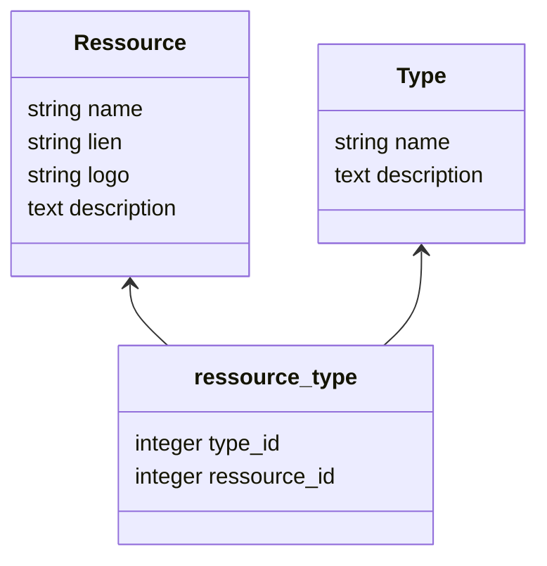

# [Readme](readme.md)

## Description

API rest de gestion d'articles

## Diagramme

```mermaid
classDiagram

class Ressource{
    string name
    string lien
    string logo
    text description
}

class Type{
    string name
    text description
}
class ressource_type{
    integer type_id
    integer ressource_id
}


Ressource <-- ressource_type
Type <-- ressource_type

```
